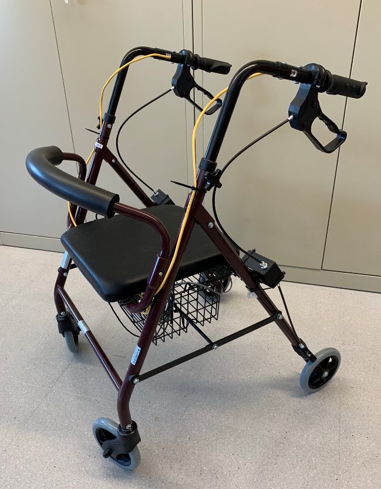
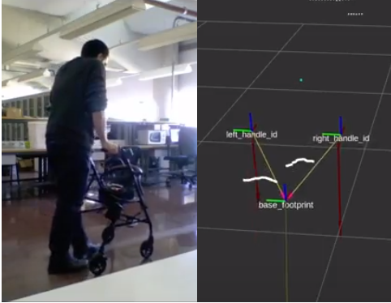

<div id="top"></div>

<!-- PROJECT SHIELDS -->
<!--
*** I'm using markdown "reference style" links for readability.
*** Reference links are enclosed in brackets [ ] instead of parentheses ( ).
*** See the bottom of this document for the declaration of the reference variables
*** for contributors-url, forks-url, etc. This is an optional, concise syntax you may use.
*** https://www.markdownguide.org/basic-syntax/#reference-style-links
-->
<div align="center">
  
[![Contributors][contributors-shield]][contributors-url]
[![Forks][forks-shield]][forks-url]
[![Stargazers][stars-shield]][stars-url]
[![Issues][issues-shield]][issues-url]
[![MIT License][license-shield]][license-url]
  
</div>

<!-- PROJECT LOGO -->
<br />
<div align="center">
  <a href="https://github.com/TaISLab/WalKit/blob/humble/">
    
  </a>

  <h3 align="center">ROS2 WalKit</h3>

  <p align="center">
    An open hardware project created to monitor the elderly unintrusively. 
    <br />
    <br />
    <a href="https://github.com/TaISLab/WalKit/issues">Report Bug</a>
    ·
    <a href="https://github.com/TaISLab/WalKit/issues">Request Feature</a>
  </p>
</div>


<!-- TABLE OF CONTENTS -->
<details>
  <summary>Table of Contents</summary>
  <ol>
    <li>
      <a href="#about-the-project">About The Project</a>
    </li>
    <li>
      <a href="#getting-started">Getting Started</a>
      <ul>
        <li><a href="#prerequisites">Prerequisites</a></li>
        <li><a href="#installation">Installation</a></li>
        <li><a href="#packages">Packages and repositories</a></li>
      </ul>
    </li>
    <li><a href="#usage">Usage</a></li>
    <li><a href="#contributing">Contributing</a></li>
    <li><a href="#license">License</a></li>
    <li><a href="#contact">Contact</a></li>
    <li><a href="#acknowledgments">Acknowledgments</a></li>
  </ol>
</details>


<!-- ABOUT THE PROJECT -->
## About The Project


WalKit is an open hardware project created to monitor the elderly unintrusively. Our system is based on ROS2 and it is modular. This allows to configure it to monitor different parameters, such as weight-bearing, cadence, activity duration, walking speed or other spatiotemporal gait parameters.

<p align="right">(<a href="#top">back to top</a>)</p>


<!-- GETTING STARTED -->
## Getting Started

WalKit is based on commercial rollators. First step would be to build and flash the necessary Arduino-based modules, as it is described in folders [firmware](https://github.com/TaISLab/WalKit/tree/humble/firmware)
 and [hardware](https://github.com/TaISLab/WalKit/tree/humble/hardware)

### Prerequisites

Once the hardware is ready, you should install Ubuntu Server 20.04 on the Raspberry Pi and ROS2 humble.

### Installation

Now we can clone and compile this (and some other related) repo(s). Note we are using 'wstool' to manage multiple repos at once. Here are the necessary commands:

```
mkdir -p ~/walker_ws/src
cd ~/walker_ws/src
git clone https://github.com/TaISLab/WalKit.git -b humble
cp WalKit/walker.rosinstall .rosinstall
sudo apt-get install python3-rosinstall  python3-rosdep2 python3-colcon-common-extensions  build-essential python3-pip
sudo -H pip3 install tmule

wstool update
# init may not be needed
sudo rosdep init
rosdep update
rosdep install --from-paths . --ignore-packages-from-source --rosdistro humble -y
colcon build --symlink-install
```
If you are compiling on the Raspberry Pi, consider being gentle on the  compilation and use the following instead of regular colcon command:
```
MAKEFLAGS='-j1 -l1' colcon build --executor sequential --symlink-install 
```

Also, package 'aws_robomaker_hospital_world' will take a  long time (>6min!) to download all the models. Consider getting a good coffee in the meantime.

### Packages

- Packages in WalKit repository:
    - firmware: arduino codes for handles and wheels. 
    - hardware: 3d models and schematics.
    - walker_arduino: ros2 nodes to interact with USB arduino boards.   
    - walker_bringup: robot specific configuration scripts and tools. 
    - walker_centroid_support: obtains weight centroid based on current support.
    - walker_description: robot description.  
    - walker_diff_odom: odometry node.
    - walker_loads: reports partial supports on each leg.
    - walker_msgs: custom handle and wheel encoder msgs.
    - walker_navigation2: nav2 configuration for walker (TODO). 
    - walker_plot: Publishes Arrow marker based on handle force readings.  
    - walker_py_cluster: (TODO)
    - walker_simulation: roller simulation in gazebo.
    - walker_slam: (TODO)
    - walker_step_detector: reports step position.
    - walker_web_gui: web interface for tests.
            
- Repositories forked for this project
    - aws-robomaker-hospital-world: simulated hospital for gazebo.  
    - bwt901cl_pkg: IMU package.   
    - csm: ROS2 port of Andrea Censeis Scan matcher, needed by laser scan matcher package.
    - leap_motion: stereo camera package (DOES NOT WORK WITH arm64)  
    - ros2_laser_scan_matcher: provides odometry from laser readings.
    - rplidar_ros2: RPLidar A1 package. 

<p align="right">(<a href="#top">back to top</a>)</p>

<!-- USAGE EXAMPLES -->
## Usage
We use Marc-Hanheide's [TMuLE](https://github.com/marc-hanheide/TMuLE) program to configure and manage a [tmux](https://github.com/tmux/tmux) session running all the components.

TMuLE can be installed with:
```
sudo -H pip3 install tmule
```

And the system can be launched with the following:
```
cd ~/walker_ws/src/WalKit/walker_bringup/config/
tmule -c walker.yaml launch --tag core
```
If you want to automatically start recording a rosbag as well, remove 'tag' option. They will be stored at '~/bagFolder'.

ROS launch files can be monitored at the tmux session. You can attach to it with the following command:
```
tmux a -t walker_ros2
```


<p align="right">(<a href="#top">back to top</a>)</p>


<!-- CONTRIBUTING -->
## Contributing

If you have a suggestion that would make this better, please fork the repo and create a pull request. You can also simply open an issue with the tag "enhancement".
Don't forget to give the project a star! Thanks again!

1. Fork the Project
2. Create your Feature Branch (`git checkout -b feature/AmazingFeature`)
3. Commit your Changes (`git commit -m 'Add some AmazingFeature'`)
4. Push to the Branch (`git push origin feature/AmazingFeature`)
5. Open a Pull Request

<p align="right">(<a href="#top">back to top</a>)</p>


<!-- LICENSE -->
## License

This project is licensed under the Creative Commons Attribution 4.0 - see [LICENSE](https://github.com/TaISLab/WalKit/blob/master/LICENSE) file for details.

<p align="right">(<a href="#top">back to top</a>)</p>


<!-- CONTACT -->
## Contact

Manuel Fernandez-Carmona - [@ermanazas](https://twitter.com/ermanazas) - manolofc at gmail.com

Project Link: [https://github.com/TaISLab/WalKit/tree/humble](https://github.com/TaISLab/WalKit/tree/humble)

<p align="right">(<a href="#top">back to top</a>)</p>


<!-- ACKNOWLEDGMENTS -->
## Acknowledgments

This work is funded by [Programa Proyectos RETOS del Ministerio de Ciencia, Innovación y Universidades (SAVIA: Sistema de Autonomía Variable para movIlidad Asistida, Ref: RTI2018-096701-B-C21)](http://www.grupoisis.uma.es/index.php?option=com_jresearch&view=project&task=show&id=208&Itemid=18&lang=es) at Málaga University, Spain

[Plan Propio de la Universidad de Málaga (E3-PROYECTOS DE PRUEBA DE CONCEPTO (E3/02/18))](https://www.uma.es/servicio-de-investigacion/cms/menu/plan-propio-de-investigacion/?set_language=en) at Málaga University, Spain

This great readme is based on [Othneil Drew](https://github.com/othneildrew/Best-README-Template)'s README template.

<p align="right">(<a href="#top">back to top</a>)</p>


<!-- MARKDOWN LINKS & IMAGES -->
<!-- https://www.markdownguide.org/basic-syntax/#reference-style-links -->
[contributors-shield]: https://img.shields.io/github/contributors/TaISLab/WalKit
[contributors-url]: https://github.com/TaISLab/WalKit/graphs/contributors
[forks-shield]: https://img.shields.io/github/forks/TaISLab/WalKit
[forks-url]: https://github.com/TaISLab/WalKit/network/members
[stars-shield]: https://img.shields.io/github/stars/TaISLab/WalKit
[stars-url]: https://github.com/TaISLab/WalKit/stargazers
[issues-shield]: https://img.shields.io/github/issues/TaISLab/WalKit
[issues-url]: https://github.com/TaISLab/WalKit/issues
[license-shield]: https://img.shields.io/github/license/TaISLab/WalKit
[license-url]: https://github.com/TaISLab/WalKit/blob/master/LICENSE
[product-screenshot]: images/screenshot.png
